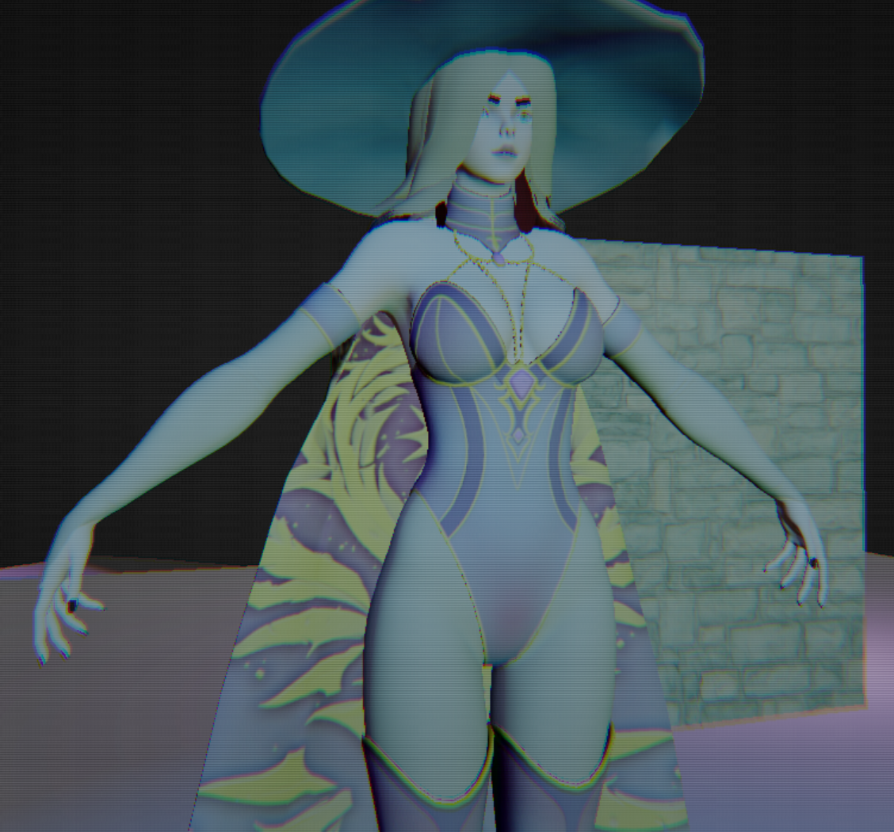
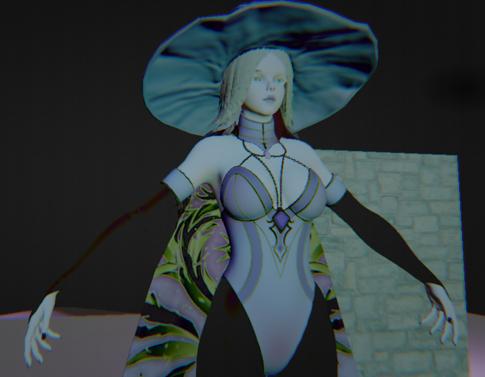

# Knight Fox — DirectX 12 Computer Graphics Playground (WIP)

**Knight Fox** is a **real-time Computer Graphics Playground (CGP)** built from scratch using **DirectX 12** and **C++20**.

This started as a small game idea, but it evolved into a renderer + shader playground where I experiment with **lighting**, **materials**, **texture techniques**, **runtime GPU mip-map generation**, and **post-processing**.

---

## Current Output


### Before


### After


---

## Project Overview

Knight Fox / CGP is an experimental sandbox for practicing and validating real-time rendering techniques:

- DirectX 12 fundamentals (swap chain, command lists, fences, RTV/DSV, descriptor heaps, etc.)
- Shader + material workflows (multiple texture slots per submesh)
- Runtime model loading (Assimp) + node hierarchy
- Texture loading (stb_image) + GPU SRV management
- **Unlimited dynamic lights** via a packed GPU structured buffer (fake bake lighting)
- GPU compute experiments (notably **runtime mip-map generation**)
- Post-processing through render-to-texture (RTT) + full-screen post pass

---

## Key Features (Implemented)

### Rendering / Engine
- Memory management and wrapper for DirectX 12 pipeline setup (swap chain, command queue/list, fences, RTV/DSV heaps etc...)
- Render-to-texture pipeline for post-processing (RTT then post pass)
- ImGui-based editor UI
- Map saving via snapshot (**Ctrl + S**), press **Space** to Free and Lock Mouse.

### Mesh & Assets
- Assimp importer for runtime 3D model loading
- Model compilation into a **tree hierarchy** with transforms preserved
- GPU upload using a staging-buffer style wrapper around `ID3D12Resource`

### Texture System
- stb_image-based image loading
- Image pool caching (avoid reloading the same textures)
- Range-based texture slot system (contiguous SRV blocks per submesh)
- Resource heap that supports **bulk allocation / deallocation** to avoid heap fragmentation

### Texture Mapping Techniques
- **Normal mapping** (TBN) + optional **detail normal mapping**
- **Height mapping** (parallax UV offset)
- **Displacement mapping** (screen-space UV displacement)
- **ORM** packed workflow (Occlusion/Roughness/Metallic)
- Ambient occlusion (from ORM or separate AO)
- Specular + glossiness (Blinn–Phong workflow support)
- Emissive mapping
- Opacity / alpha cutout (clip-based discard)

### Lighting (Unlimited Counts)
All lights share a common interface and are uploaded each frame (dirty rebuild) as a packed structured buffer:
- **Directional lights** (Lambert diffuse)
- **Point lights** (Lambert + optional Blinn–Phong specular) with distance attenuation + smooth range fade
- **Spot lights** (point light model + cone attenuation with inner/outer cone + softness)
- Distance-based culling for local lights (directional lights always included)

### GPU Mip-Map Generation
- Runtime mip-map generation on the GPU using a compute shader downsampling approach
- Per-subresource state transitions: previous mip as SRV, next mip as UAV
- Simple 2×2 box filter downsample

### Post Processing (Post Pass)
Screen-space effects applied in a full-screen shader (individually toggleable):
- Exposure
- Gamma correction
- Contrast
- Saturation / Grayscale
- Invert
- Vignette (+ power control)
- Chromatic aberration
- Scanlines
- Film grain
- Dithering
- Fade
- Radial blur (mouse-driven)

---

## Planned Work
- Shadows
- Scene Based system instead of a single world
- Post Effects with Depths.
- More rendering experiments (custom shading models, skybox, simple volumetrics etc...).

---

## Requirements
- Windows 10/11
- Visual Studio 2022
- Windows 10 SDK
- DirectX 12 compatible GPU

---

## Build Instructions (vcpkg)
```powershell
git clone https://github.com/microsoft/vcpkg.git 
C:\dev\vcpkg
cd C:\dev\vcpkg
.\bootstrap-vcpkg.bat
.\vcpkg integrate install
.\vcpkg install assimp:x64-windows

git clone https://github.com/Niffoxic/KnightFox.git
```
Open the solution, set configuration to x64 (Debug for editor / Release for application), build and run.
