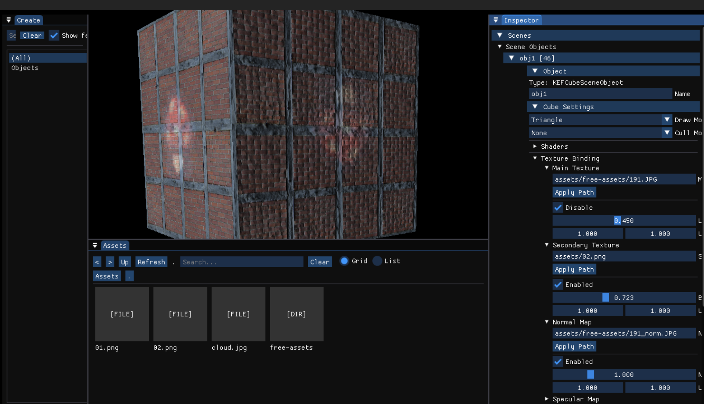

# Knight Fox — DirectX 12 Sandbox Horror Prototype (WIP)

**Knight Fox** is a **third-person sandbox horror prototype** built entirely from scratch using **DirectX 12** and **C++20** in **Visual Studio 2022**.  
The primary purpose of this project is to **practice computer graphics**, renderer design, and low-level engine architecture - not to build a full commercial game.

---

## Current Output

---

## Project Overview

Knight Fox is a small experimental sandbox where I test:

- DirectX 12 fundamentals  
- Rendering pipelines  
- Descriptor heaps, command queues, and GPU synchronization  
- Camera + controls  
- Geometry, materials, and basic lighting and shadows
- Engine architecture patterns  

There's **no PBR**, no large asset pipeline, and no big engine features planned — the project's whole point is to explore graphics concepts freely.

---

## Current Features

- Third-person camera and movement  
- Basic scene rendering  
- DX12 pipeline setup (swap chain, command list, fences, RTV/DSV heaps, etc.)  
- Constant buffer system  
- Vertex/index buffer rendering path  
- Texture support (early stage)  

---

## Planned Work

- Sandbox tools to spawn objects and debug visuals  
- Simple lighting (non-PBR)  
- Fog, color grading, and basic post effects  
- Simple animation support  
- Data-driven scene loading  
- More rendering experiments:  
  - shadow tests  
  - custom shading models  
  - skybox, volumetrics (basic)  

---

## Requirements

- Windows 10/11  
- Visual Studio 2022  
- Windows 10 SDK  
- DirectX 12 compatible GPU  

Open the solution → set configuration to **x64** → build and run.

---

## Development Status

Knight Fox is **in early WIP**, heavily focused on practicing low-level rendering techniques and experimenting with graphics.  
Nothing is final — expect constant redesigns and refactors.

---
